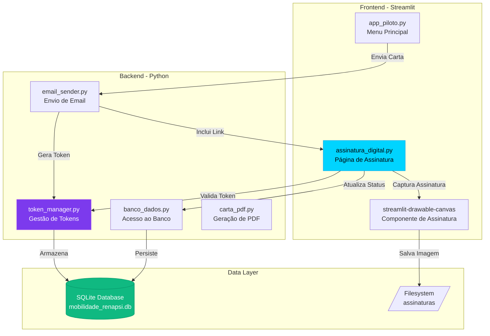
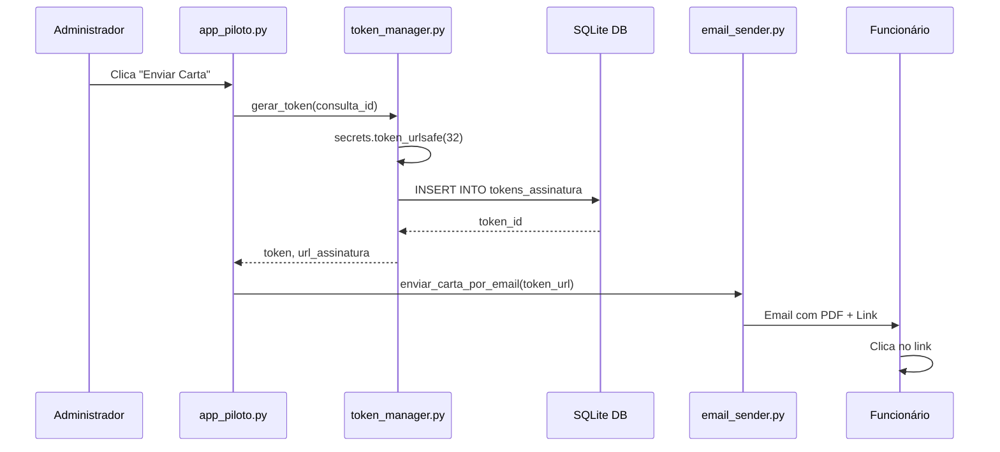
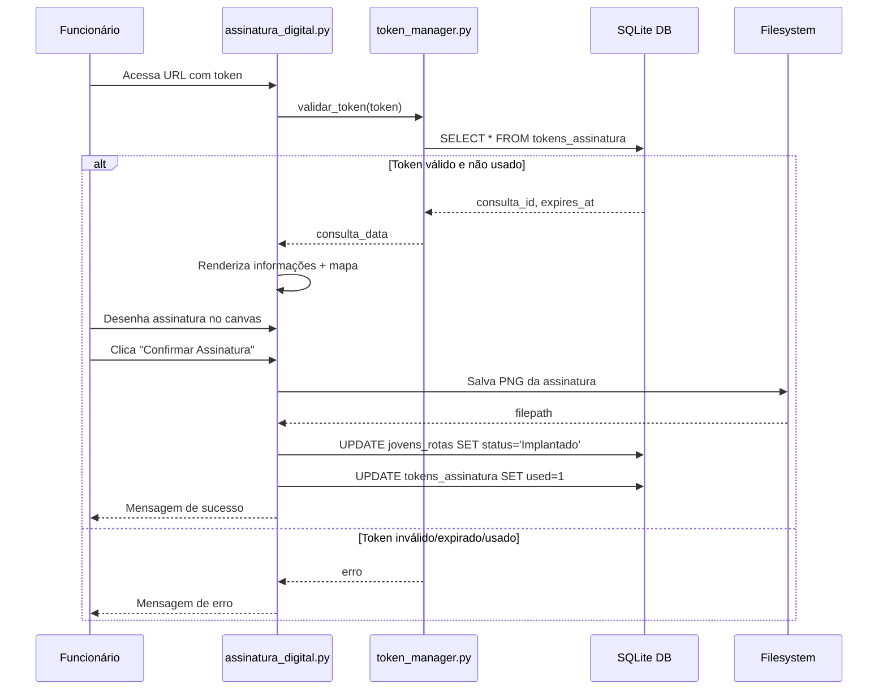
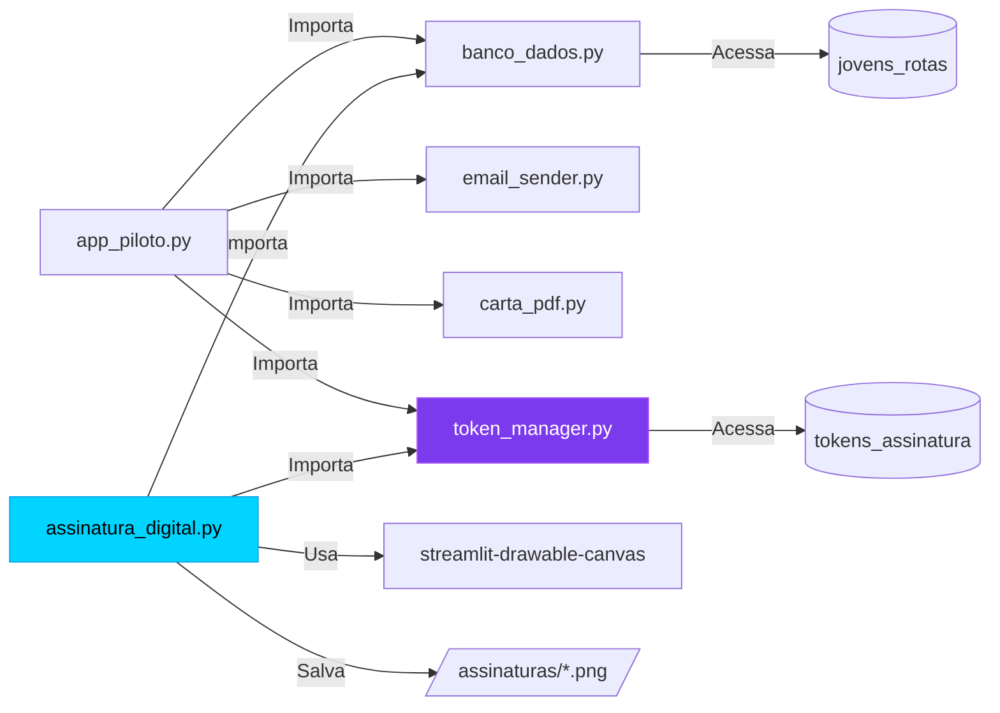
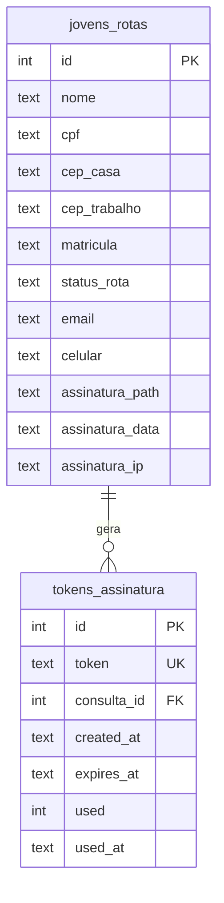
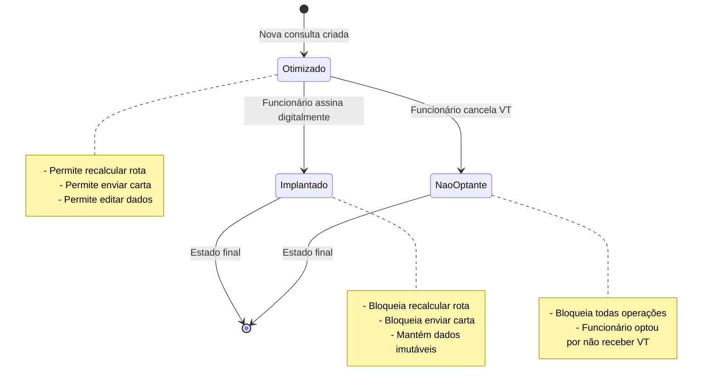

# Design Document: Gestão de Status e Assinatura Digital

## Overview

Este documento apresenta o design técnico completo para o sistema de gestão de status de funcionários e assinatura digital de Vale-Transporte (VT) no sistema RENAPSI. A solução permite que funcionários assinem digitalmente suas cartas de VT através de um link único enviado por email, além de gerenciar diferentes status de adesão ao programa.

### Objetivos

- Implementar gestão de ciclo de vida do VT com três status: "Otimizado", "Implantado" e "Não Optante"
- Criar sistema de tokens seguros para autenticação de assinatura
- Desenvolver página web dedicada para visualização e assinatura de cartas
- Integrar assinatura digital com canvas interativo
- Garantir segurança e auditabilidade do processo

### Escopo

**Incluído:**
- Extensão do banco de dados SQLite com novas tabelas e colunas
- Geração e validação de tokens criptográficos
- Página Streamlit para assinatura digital
- Captura de assinatura via canvas (streamlit-drawable-canvas)
- Integração com sistema de envio de email existente
- Controle de status e bloqueio de ações baseado em estado

**Excluído:**
- Autenticação de usuário via login/senha (usa apenas token único)
- Notificações push ou SMS
- Integração com sistemas externos de RH
- Assinatura eletrônica com certificado digital ICP-Brasil

## Architecture

### High-Level Architecture



### Data Flow - Envio de Carta com Token



### Data Flow - Assinatura Digital



### Component Interaction



## Components and Interfaces

### 1. token_manager.py

Módulo responsável pela geração, validação e gerenciamento de tokens de assinatura.

#### Funções Principais

```python
def gerar_token(consulta_id: int) -> dict:
    """
    Gera um token único e seguro para assinatura.
    
    Args:
        consulta_id: ID da consulta na tabela jovens_rotas
        
    Returns:
        {
            'token': str,              # Token gerado (43+ caracteres)
            'url': str,                # URL completa para assinatura
            'expires_at': str,         # Timestamp de expiração (ISO 8601)
            'created_at': str          # Timestamp de criação (ISO 8601)
        }
        
    Raises:
        ValueError: Se consulta_id não existir
        sqlite3.Error: Em caso de erro no banco
    """
    pass

def validar_token(token: str) -> dict:
    """
    Valida um token e retorna dados da consulta associada.
    
    Args:
        token: Token a ser validado
        
    Returns:
        {
            'valido': bool,
            'consulta_id': int | None,
            'erro': str | None,        # 'expirado', 'usado', 'invalido'
            'dados_consulta': dict | None
        }
    """
    pass

def marcar_token_usado(token: str) -> bool:
    """
    Marca um token como usado após assinatura ou cancelamento.
    
    Args:
        token: Token a ser marcado
        
    Returns:
        True se sucesso, False caso contrário
    """
    pass

def limpar_tokens_expirados() -> int:
    """
    Remove tokens expirados e não usados do banco.
    
    Returns:
        Número de tokens removidos
    """
    pass
```

#### Algoritmo de Geração de Token

```python
import secrets
from datetime import datetime, timedelta

def _gerar_token_seguro() -> str:
    """
    Gera token usando secrets.token_urlsafe para garantir
    segurança criptográfica.
    
    - Usa 32 bytes de entropia
    - Resulta em ~43 caracteres base64url
    - Seguro contra ataques de força bruta
    """
    return secrets.token_urlsafe(32)

def _calcular_expiracao(dias: int = 30) -> str:
    """
    Calcula timestamp de expiração.
    
    Args:
        dias: Número de dias até expiração (padrão: 30)
        
    Returns:
        Timestamp ISO 8601 (YYYY-MM-DD HH:MM:SS)
    """
    expira_em = datetime.now() + timedelta(days=dias)
    return expira_em.strftime("%Y-%m-%d %H:%M:%S")
```

### 2. assinatura_digital.py

Nova página Streamlit dedicada à assinatura digital.

#### Estrutura Principal

```python
import streamlit as st
from streamlit_drawable_canvas import st_canvas
import folium
from streamlit_folium import st_folium
from token_manager import validar_token, marcar_token_usado
from banco_dados import obter_consulta_por_id, atualizar_status_consulta
import os
from datetime import datetime

def main():
    """Função principal da página de assinatura."""
    st.set_page_config(
        page_title="Assinatura de Vale-Transporte",
        page_icon="✍️",
        layout="wide"
    )
    
    # Aplica CSS dark theme
    aplicar_tema_dark()
    
    # Extrai token da URL
    token = st.query_params.get("token")
    
    if not token:
        exibir_erro_sem_token()
        return
    
    # Valida token
    resultado_validacao = validar_token(token)
    
    if not resultado_validacao['valido']:
        exibir_erro_token(resultado_validacao['erro'])
        return
    
    # Carrega dados da consulta
    dados_consulta = resultado_validacao['dados_consulta']
    
    # Renderiza página de assinatura
    renderizar_pagina_assinatura(dados_consulta, token)

def renderizar_pagina_assinatura(dados: dict, token: str):
    """Renderiza a interface completa de assinatura."""
    # Header
    exibir_header()
    
    # Cards de informação
    exibir_cards_informacao(dados)
    
    # Mapa da rota
    exibir_mapa_rota(dados)
    
    # Detalhes da rota
    exibir_detalhes_rota(dados)
    
    # Botões de ação
    col1, col2, col3 = st.columns(3)
    
    with col1:
        if st.button("📄 Baixar Carta", use_container_width=True):
            baixar_carta_pdf(dados)
    
    with col2:
        if st.button("❌ Cancelar VT (Não Optante)", 
                     use_container_width=True, 
                     type="secondary"):
            processar_cancelamento(dados['id'], token)
    
    with col3:
        if st.button("✍️ Aceitar e Assinar", 
                     use_container_width=True, 
                     type="primary"):
            st.session_state.mostrar_modal_assinatura = True
    
    # Modal de assinatura
    if st.session_state.get('mostrar_modal_assinatura'):
        exibir_modal_assinatura(dados, token)
```

#### Modal de Assinatura

```python
def exibir_modal_assinatura(dados: dict, token: str):
    """
    Exibe modal com canvas para captura de assinatura.
    """
    with st.container():
        st.markdown("### ✍️ Assine Aqui")
        st.markdown("Desenhe sua assinatura no espaço abaixo:")
        
        # Canvas de assinatura
        canvas_result = st_canvas(
            fill_color="rgba(255, 255, 255, 0)",
            stroke_width=3,
            stroke_color="#00D4FF",
            background_color="#0D1117",
            height=200,
            width=600,
            drawing_mode="freedraw",
            key="canvas_assinatura",
        )
        
        col_limpar, col_confirmar = st.columns(2)
        
        with col_limpar:
            if st.button("🗑️ Limpar", use_container_width=True):
                st.session_state.canvas_assinatura = None
                st.rerun()
        
        with col_confirmar:
            if st.button("✅ Confirmar Assinatura", 
                        use_container_width=True, 
                        type="primary"):
                processar_assinatura(canvas_result, dados, token)

def processar_assinatura(canvas_result, dados: dict, token: str):
    """
    Processa e salva a assinatura capturada.
    """
    if canvas_result.image_data is None:
        st.error("Por favor, desenhe sua assinatura antes de confirmar.")
        return
    
    # Verifica se canvas está vazio
    if not canvas_tem_conteudo(canvas_result.image_data):
        st.error("Por favor, desenhe sua assinatura antes de confirmar.")
        return
    
    with st.spinner("Processando assinatura..."):
        try:
            # Salva imagem da assinatura
            filepath = salvar_assinatura_png(
                canvas_result.image_data, 
                dados['id']
            )
            
            # Atualiza banco de dados
            atualizar_consulta_com_assinatura(
                consulta_id=dados['id'],
                filepath=filepath,
                ip_address=obter_ip_cliente()
            )
            
            # Marca token como usado
            marcar_token_usado(token)
            
            st.success("✅ Assinatura confirmada com sucesso!")
            st.balloons()
            
            # Limpa estado e redireciona
            time.sleep(3)
            st.session_state.clear()
            st.rerun()
            
        except Exception as e:
            st.error(f"❌ Erro ao processar assinatura: {str(e)}")
```

### 3. Extensões em banco_dados.py

```python
def criar_tabela_tokens():
    """
    Cria tabela tokens_assinatura se não existir.
    """
    conexao = sqlite3.connect('mobilidade_renapsi.db')
    cursor = conexao.cursor()
    
    cursor.execute('''
        CREATE TABLE IF NOT EXISTS tokens_assinatura (
            id INTEGER PRIMARY KEY AUTOINCREMENT,
            token TEXT UNIQUE NOT NULL,
            consulta_id INTEGER NOT NULL,
            created_at TEXT NOT NULL,
            expires_at TEXT NOT NULL,
            used INTEGER DEFAULT 0,
            used_at TEXT,
            FOREIGN KEY (consulta_id) REFERENCES jovens_rotas(id)
        )
    ''')
    
    # Índices para performance
    cursor.execute('''
        CREATE INDEX IF NOT EXISTS idx_token 
        ON tokens_assinatura(token)
    ''')
    
    cursor.execute('''
        CREATE INDEX IF NOT EXISTS idx_consulta_id 
        ON tokens_assinatura(consulta_id)
    ''')
    
    conexao.commit()
    conexao.close()

def adicionar_colunas_assinatura():
    """
    Adiciona colunas de assinatura à tabela jovens_rotas.
    """
    conexao = sqlite3.connect('mobilidade_renapsi.db')
    cursor = conexao.cursor()
    
    colunas_novas = [
        ("assinatura_path", "TEXT"),
        ("assinatura_data", "TEXT"),
        ("assinatura_ip", "TEXT")
    ]
    
    for coluna, tipo in colunas_novas:
        try:
            cursor.execute(
                f"ALTER TABLE jovens_rotas ADD COLUMN {coluna} {tipo}"
            )
        except sqlite3.OperationalError:
            # Coluna já existe
            pass
    
    conexao.commit()
    conexao.close()

def atualizar_consulta_com_assinatura(
    consulta_id: int,
    filepath: str,
    ip_address: str
) -> bool:
    """
    Atualiza consulta com dados da assinatura e muda status para Implantado.
    
    Args:
        consulta_id: ID da consulta
        filepath: Caminho do arquivo PNG da assinatura
        ip_address: IP do cliente que assinou
        
    Returns:
        True se sucesso, False caso contrário
    """
    try:
        conexao = sqlite3.connect('mobilidade_renapsi.db')
        cursor = conexao.cursor()
        
        timestamp_atual = datetime.now().strftime("%Y-%m-%d %H:%M:%S")
        
        cursor.execute('''
            UPDATE jovens_rotas 
            SET status_rota = 'Implantado',
                assinatura_path = ?,
                assinatura_data = ?,
                assinatura_ip = ?
            WHERE id = ?
        ''', (filepath, timestamp_atual, ip_address, consulta_id))
        
        linhas_afetadas = cursor.rowcount
        conexao.commit()
        conexao.close()
        
        return linhas_afetadas > 0
        
    except Exception as e:
        print(f"Erro ao atualizar consulta: {e}")
        return False
```

### 4. Integração com email_sender.py

```python
def enviar_carta_com_token(
    destinatario: str,
    nome_funcionario: str,
    pdf_bytes: bytes,
    token_url: str
) -> tuple[bool, str]:
    """
    Envia carta por email incluindo link de assinatura.
    
    Args:
        destinatario: Email do funcionário
        nome_funcionario: Nome completo
        pdf_bytes: Bytes do PDF da carta
        token_url: URL completa com token para assinatura
        
    Returns:
        (sucesso: bool, mensagem_erro: str)
    """
    corpo_html = f"""
    <html>
    <body style="font-family: Arial, sans-serif; color: #333; 
                 background: #f9f9f9; padding: 20px;">
        <div style="max-width: 600px; margin: auto; background: white;
                    border-radius: 8px; padding: 32px;
                    border-top: 4px solid #00D4FF;">
            <h2 style="color:#1a3a5c;margin-top:0;">
                Carta de Opção de Transporte e Mobilidade
            </h2>
            <p>Olá, <strong>{nome_funcionario}</strong>,</p>
            <p>
                Segue em anexo a sua <strong>Carta de Opção de Transporte 
                e Mobilidade</strong> gerada pelo sistema RENAPSI.
            </p>
            
            <div style="background:#f0f9ff;border-left:4px solid #00D4FF;
                        padding:16px;margin:24px 0;border-radius:4px;">
                <p style="margin:0 0 12px;font-weight:600;color:#0369a1;">
                    ✍️ Assinatura Digital Disponível
                </p>
                <p style="margin:0 0 12px;font-size:14px;">
                    Para assinar digitalmente sua carta de VT, 
                    acesse o link abaixo:
                </p>
                <a href="{token_url}" 
                   style="display:inline-block;background:#00D4FF;
                          color:#0A0E1A;padding:12px 24px;
                          text-decoration:none;border-radius:6px;
                          font-weight:600;margin-top:8px;">
                    Assinar Carta de VT
                </a>
                <p style="margin:12px 0 0;font-size:12px;color:#64748B;">
                    Este link é válido por 30 dias e pode ser usado apenas uma vez.
                </p>
            </div>
            
            <p style="font-size:13px;color:#64748B;">
                Caso prefira, você também pode imprimir o PDF em anexo, 
                assinar manualmente e devolver conforme orientação do seu gestor.
            </p>
            
            <hr style="border:none;border-top:1px solid #eee;margin:24px 0;">
            <p style="font-size:12px;color:#888;">
                Este e-mail foi gerado automaticamente pelo sistema de 
                mobilidade RENAPSI.<br>
                Em caso de dúvidas, entre em contato com o setor de RH.
            </p>
        </div>
    </body>
    </html>
    """
    
    # Restante da implementação igual ao email_sender.py existente
    # ...
```

## Data Models

### Database Schema

#### Tabela: tokens_assinatura (NOVA)

```sql
CREATE TABLE tokens_assinatura (
    id INTEGER PRIMARY KEY AUTOINCREMENT,
    token TEXT UNIQUE NOT NULL,
    consulta_id INTEGER NOT NULL,
    created_at TEXT NOT NULL,           -- ISO 8601: YYYY-MM-DD HH:MM:SS
    expires_at TEXT NOT NULL,           -- ISO 8601: YYYY-MM-DD HH:MM:SS
    used INTEGER DEFAULT 0,             -- 0 = não usado, 1 = usado
    used_at TEXT,                       -- ISO 8601: YYYY-MM-DD HH:MM:SS
    FOREIGN KEY (consulta_id) REFERENCES jovens_rotas(id)
);

CREATE INDEX idx_token ON tokens_assinatura(token);
CREATE INDEX idx_consulta_id ON tokens_assinatura(consulta_id);
CREATE INDEX idx_expires_at ON tokens_assinatura(expires_at);
```

**Campos:**
- `id`: Chave primária auto-incremento
- `token`: Token único gerado (43+ caracteres, base64url)
- `consulta_id`: FK para jovens_rotas.id
- `created_at`: Timestamp de criação
- `expires_at`: Timestamp de expiração (created_at + 30 dias)
- `used`: Flag indicando se token foi usado (0 ou 1)
- `used_at`: Timestamp de quando foi usado (NULL se não usado)

#### Tabela: jovens_rotas (EXTENSÃO)

```sql
-- Colunas adicionadas à tabela existente
ALTER TABLE jovens_rotas ADD COLUMN assinatura_path TEXT;
ALTER TABLE jovens_rotas ADD COLUMN assinatura_data TEXT;
ALTER TABLE jovens_rotas ADD COLUMN assinatura_ip TEXT;
```

**Novos Campos:**
- `assinatura_path`: Caminho do arquivo PNG da assinatura
  - Formato: `assinaturas/assinatura_{consulta_id}_{timestamp}.png`
- `assinatura_data`: Timestamp da assinatura (ISO 8601)
- `assinatura_ip`: Endereço IP do cliente que assinou

### Entity Relationship Diagram



### Data Validation Rules

**tokens_assinatura:**
- `token`: UNIQUE, NOT NULL, mínimo 32 caracteres
- `consulta_id`: Deve existir em jovens_rotas.id
- `created_at`: Formato ISO 8601, não pode ser futuro
- `expires_at`: Deve ser > created_at
- `used`: Apenas 0 ou 1
- `used_at`: NULL se used=0, NOT NULL se used=1

**jovens_rotas (novos campos):**
- `assinatura_path`: Deve apontar para arquivo existente se NOT NULL
- `assinatura_data`: Formato ISO 8601
- `assinatura_ip`: Formato IPv4 ou IPv6 válido

### Status State Machine



## Correctness Properties

*A property is a characteristic or behavior that should hold true across all valid executions of a system—essentially, a formal statement about what the system should do. Properties serve as the bridge between human-readable specifications and machine-verifiable correctness guarantees.*


### Property Reflection

Após análise inicial, identifiquei as seguintes redundâncias e oportunidades de consolidação:

**Redundâncias Identificadas:**
1. Propriedades 1.3, 1.4, 1.6, 1.7 (desabilitar botões baseado em status) podem ser consolidadas em uma única propriedade sobre controle de UI baseado em estado
2. Propriedades 5.4 e 5.5 (cancelamento atualiza status e marca token) podem ser combinadas em uma propriedade sobre atomicidade da operação de cancelamento
3. Propriedades 6.9 e 6.10 (assinatura atualiza status e marca token) podem ser combinadas em uma propriedade sobre atomicidade da operação de assinatura
4. Propriedades 3.2, 3.3, 3.4 (diferentes mensagens de erro) são casos específicos que podem ser testados como exemplos, não propriedades universais
5. Propriedades sobre renderização de UI (4.x, 13.x) podem ser consolidadas em propriedades mais abrangentes sobre completude da interface

**Propriedades Mantidas:**
- Propriedades sobre geração e unicidade de tokens (fundamentais para segurança)
- Propriedades sobre validação e expiração de tokens
- Propriedades sobre persistência de dados
- Propriedades sobre ordem de execução (validação antes de renderização, token antes de email)
- Propriedades sobre invariantes (status não muda no download, cleanup preserva tokens usados)

### Property 1: Status Value Constraint

*For any* consulta in the system, the status_rota field SHALL contain only one of three valid values: "Otimizado", "Implantado", or "Não Optante".

**Validates: Requirements 1.1**

### Property 2: Default Status Initialization

*For any* newly created consulta, the status_rota field SHALL be initialized to "Otimizado".

**Validates: Requirements 1.2**

### Property 3: UI Control Based on Status

*For any* consulta with status_rota equal to "Implantado" or "Não Optante", the system SHALL disable route recalculation and carta sending functionality.

**Validates: Requirements 1.3, 1.4, 1.6, 1.7**

### Property 4: Token Uniqueness

*For all* generated tokens in the tokens_assinatura table, each token value SHALL be unique across the entire table.

**Validates: Requirements 2.7**

### Property 5: Token Security Requirements

*For any* generated Token_Assinatura, the token SHALL be at least 32 characters long and generated using a cryptographically secure random function.

**Validates: Requirements 2.2**

### Property 6: Token Expiration Calculation

*For any* generated Token_Assinatura, the expires_at timestamp SHALL be exactly 30 days after the created_at timestamp.

**Validates: Requirements 2.4**

### Property 7: Token Storage Completeness

*For any* generated Token_Assinatura, the system SHALL store the token, consulta_id, created_at, expires_at, and used status in the tokens_assinatura table.

**Validates: Requirements 2.3, 2.8**

### Property 8: Token URL Format

*For any* generated Token_Assinatura, the system SHALL construct a URL following the pattern "http://localhost:8501/assinar?token={token_value}".

**Validates: Requirements 2.5**

### Property 9: Email Contains Token URL

*For any* carta sent via email, the email body SHALL contain the generated token URL.

**Validates: Requirements 2.6, 11.3**

### Property 10: Token Validation Before Data Access

*For any* access to the Página_Assinatura, the system SHALL validate the token before rendering any sensitive funcionário data.

**Validates: Requirements 3.7**

### Property 11: Valid Token Retrieves Consulta

*For any* valid (existing, not expired, not used) token, the validation process SHALL successfully retrieve the associated consulta_id and all consulta data.

**Validates: Requirements 3.5, 3.6**

### Property 12: Invalid Token Shows Error

*For any* token that is non-existent, expired, or already used, the system SHALL display an appropriate error message and prevent access to consulta data.

**Validates: Requirements 3.2, 3.3, 3.4**

### Property 13: Download Preserves Status

*For any* "Baixar Carta" action, the consulta's status_rota SHALL remain unchanged before and after the download.

**Validates: Requirements 5.2**

### Property 14: Cancelamento Atomicity

*For any* "Cancelar VT" action, the system SHALL atomically update status_rota to "Não Optante" AND mark the token as used (used=1, used_at=timestamp).

**Validates: Requirements 5.4, 5.5**

### Property 15: Empty Canvas Rejection

*For any* attempt to confirm an assinatura with an empty canvas, the system SHALL display an error message and prevent the confirmation.

**Validates: Requirements 6.6**

### Property 16: Assinatura Atomicity

*For any* valid signature confirmation, the system SHALL atomically: (1) save the signature image file, (2) update status_rota to "Implantado", (3) store the file path in assinatura_path, (4) mark the token as used.

**Validates: Requirements 6.8, 6.9, 6.10, 7.4**

### Property 17: Signature File Naming Convention

*For any* saved signature file, the filename SHALL match the pattern "assinatura_{consulta_id}_{timestamp}.png" and be stored in the "assinaturas/" directory.

**Validates: Requirements 7.1, 7.2, 7.3**

### Property 18: File Save Before Status Update

*For any* signature confirmation, if the file save operation fails, the system SHALL NOT update the status_rota and SHALL display an error message.

**Validates: Requirements 7.6, 7.7**

### Property 19: Token Generation Before Email

*For any* "Gerar e Enviar" action, the system SHALL generate and store the token in Banco_Tokens before sending the email.

**Validates: Requirements 11.1, 11.5**

### Property 20: Token Usage Marking

*For any* token that is used (via signature confirmation or VT cancellation), the system SHALL set used=1 and record the used_at timestamp.

**Validates: Requirements 12.1, 12.2**

### Property 21: Used Token Rejection

*For any* attempt to access a token where used=1, the system SHALL display the error message "Este link já foi utilizado" and prevent access.

**Validates: Requirements 12.3**

### Property 22: Token Cleanup Selectivity

*For any* token cleanup operation, the system SHALL delete only tokens where used=0 AND expires_at < current_timestamp, preserving all used tokens regardless of expiration.

**Validates: Requirements 15.4, 15.5**

### Property 23: Cleanup Execution on Startup

*For any* application startup, the token cleanup function SHALL execute automatically.

**Validates: Requirements 15.2**

## Error Handling

### Token Validation Errors

**Erro: Token Inválido**
- **Causa**: Token não existe no banco de dados
- **Resposta**: Exibir página de erro com mensagem "Token inválido ou expirado"
- **Ação do Usuário**: Solicitar novo link ao administrador
- **Log**: Registrar tentativa de acesso com token inválido (IP, timestamp, token)

**Erro: Token Expirado**
- **Causa**: current_time > expires_at
- **Resposta**: Exibir página de erro com mensagem "Token expirado"
- **Ação do Usuário**: Solicitar novo link ao administrador
- **Log**: Registrar tentativa de acesso com token expirado

**Erro: Token Já Utilizado**
- **Causa**: used = 1
- **Resposta**: Exibir página de erro com mensagem "Este link já foi utilizado"
- **Ação do Usuário**: Contatar RH se necessário reabrir processo
- **Log**: Registrar tentativa de reutilização de token

### Signature Processing Errors

**Erro: Canvas Vazio**
- **Causa**: Usuário tenta confirmar sem desenhar assinatura
- **Resposta**: Exibir alerta "Por favor, desenhe sua assinatura"
- **Ação do Usuário**: Desenhar assinatura e tentar novamente
- **Recuperação**: Automática, usuário pode tentar novamente

**Erro: Falha ao Salvar Arquivo**
- **Causa**: Erro de I/O ao salvar PNG (disco cheio, permissões, etc.)
- **Resposta**: Exibir erro "Erro ao salvar assinatura. Tente novamente."
- **Ação do Sistema**: NÃO atualizar status_rota, NÃO marcar token como usado
- **Ação do Usuário**: Tentar novamente ou contatar suporte
- **Log**: Registrar erro com stack trace completo

**Erro: Falha na Atualização do Banco**
- **Causa**: Erro SQL ao atualizar jovens_rotas ou tokens_assinatura
- **Resposta**: Exibir erro "Erro ao processar assinatura. Contate o suporte."
- **Ação do Sistema**: Rollback de transação, manter estado anterior
- **Ação do Usuário**: Contatar suporte técnico
- **Log**: Registrar erro SQL com detalhes da transação

### Email Sending Errors

**Erro: Email Não Cadastrado**
- **Causa**: Campo email vazio ou NULL na consulta
- **Resposta**: Exibir aviso "Este funcionário não possui e-mail cadastrado"
- **Ação do Usuário**: Editar dados do funcionário para adicionar email
- **Recuperação**: Automática após adicionar email

**Erro: Falha no Envio SMTP**
- **Causa**: Erro de autenticação, conexão, ou servidor SMTP
- **Resposta**: Exibir erro com detalhes técnicos
- **Ação do Sistema**: Token já foi gerado e salvo
- **Ação do Usuário**: Tentar reenviar ou usar link manualmente
- **Recuperação**: Administrador pode copiar URL do token e enviar manualmente
- **Log**: Registrar erro SMTP completo

### Database Errors

**Erro: Consulta Não Encontrada**
- **Causa**: consulta_id não existe em jovens_rotas
- **Resposta**: Exibir erro "Consulta não encontrada"
- **Ação do Sistema**: Impedir geração de token
- **Log**: Registrar tentativa com ID inválido

**Erro: Violação de Unicidade de Token**
- **Causa**: Token duplicado (extremamente raro com secrets.token_urlsafe)
- **Resposta**: Gerar novo token automaticamente
- **Ação do Sistema**: Retry com novo token (máximo 3 tentativas)
- **Log**: Registrar colisão de token (alerta de segurança)

### Rate Limiting

**Erro: Limite de Tentativas Excedido**
- **Causa**: Mais de 10 tentativas de validação de token do mesmo IP em 1 hora
- **Resposta**: Exibir erro "Muitas tentativas. Aguarde 1 hora."
- **Ação do Sistema**: Bloquear IP temporariamente
- **Ação do Usuário**: Aguardar ou usar IP diferente
- **Log**: Registrar possível ataque de força bruta

## Testing Strategy

### Unit Tests

**Objetivo**: Testar funções individuais e lógica de negócio isoladamente.

**Escopo**:
- Funções de geração de token (token_manager.py)
- Funções de validação de token
- Funções de manipulação de banco de dados (banco_dados.py)
- Lógica de cálculo de expiração
- Formatação de URLs
- Validação de formato de token

**Ferramentas**: pytest

**Exemplos de Testes**:
```python
def test_gerar_token_retorna_dict_valido():
    """Testa que gerar_token retorna estrutura correta."""
    resultado = gerar_token(consulta_id=1)
    assert 'token' in resultado
    assert 'url' in resultado
    assert 'expires_at' in resultado
    assert len(resultado['token']) >= 32

def test_validar_token_inexistente_retorna_erro():
    """Testa que token inexistente é rejeitado."""
    resultado = validar_token("token_que_nao_existe")
    assert resultado['valido'] == False
    assert resultado['erro'] == 'invalido'

def test_marcar_token_usado_atualiza_banco():
    """Testa que marcar token como usado persiste no banco."""
    token = criar_token_teste()
    sucesso = marcar_token_usado(token)
    assert sucesso == True
    # Verifica no banco
    conn = sqlite3.connect('mobilidade_renapsi.db')
    cursor = conn.cursor()
    cursor.execute("SELECT used FROM tokens_assinatura WHERE token = ?", (token,))
    assert cursor.fetchone()[0] == 1
    conn.close()

def test_calcular_expiracao_adiciona_30_dias():
    """Testa que expiração é exatamente 30 dias no futuro."""
    from datetime import datetime, timedelta
    created = datetime.now()
    expires = _calcular_expiracao(30)
    expires_dt = datetime.strptime(expires, "%Y-%m-%d %H:%M:%S")
    diferenca = expires_dt - created
    assert 29 <= diferenca.days <= 30  # Tolerância de 1 dia por arredondamento
```

### Property-Based Tests

**Objetivo**: Verificar propriedades universais através de muitos inputs gerados aleatoriamente.

**Ferramentas**: Hypothesis (Python)

**Configuração**: Mínimo 100 iterações por teste

**Exemplos de Testes**:

```python
from hypothesis import given, strategies as st
import hypothesis

@given(st.integers(min_value=1, max_value=10000))
def test_property_token_uniqueness(consulta_id):
    """
    Property 4: Token Uniqueness
    Para qualquer consulta_id, tokens gerados devem ser únicos.
    
    Feature: gestao-status-e-assinatura-digital, Property 4: Token Uniqueness
    """
    tokens_gerados = set()
    for _ in range(10):  # Gera 10 tokens para mesma consulta
        resultado = gerar_token(consulta_id)
        token = resultado['token']
        assert token not in tokens_gerados, "Token duplicado detectado!"
        tokens_gerados.add(token)

@given(st.integers(min_value=1, max_value=10000))
def test_property_token_length(consulta_id):
    """
    Property 5: Token Security Requirements
    Para qualquer token gerado, deve ter >= 32 caracteres.
    
    Feature: gestao-status-e-assinatura-digital, Property 5: Token Security Requirements
    """
    resultado = gerar_token(consulta_id)
    assert len(resultado['token']) >= 32

@given(st.integers(min_value=1, max_value=10000))
def test_property_expiration_30_days(consulta_id):
    """
    Property 6: Token Expiration Calculation
    Para qualquer token, expires_at deve ser created_at + 30 dias.
    
    Feature: gestao-status-e-assinatura-digital, Property 6: Token Expiration Calculation
    """
    from datetime import datetime, timedelta
    resultado = gerar_token(consulta_id)
    created = datetime.strptime(resultado['created_at'], "%Y-%m-%d %H:%M:%S")
    expires = datetime.strptime(resultado['expires_at'], "%Y-%m-%d %H:%M:%S")
    diferenca = expires - created
    assert 29 <= diferenca.days <= 30

@given(st.text(min_size=1, max_size=100))
def test_property_invalid_token_rejected(random_token):
    """
    Property 12: Invalid Token Shows Error
    Para qualquer token inválido, validação deve falhar.
    
    Feature: gestao-status-e-assinatura-digital, Property 12: Invalid Token Shows Error
    """
    # Assume que random_token não existe no banco
    resultado = validar_token(random_token)
    assert resultado['valido'] == False

@given(st.integers(min_value=1, max_value=10000))
def test_property_download_preserves_status(consulta_id):
    """
    Property 13: Download Preserves Status
    Para qualquer download de carta, status não deve mudar.
    
    Feature: gestao-status-e-assinatura-digital, Property 13: Download Preserves Status
    """
    # Cria consulta com status conhecido
    criar_consulta_teste(consulta_id, status="Otimizado")
    status_antes = obter_status_consulta(consulta_id)
    
    # Simula download (não muda status)
    baixar_carta_pdf({'id': consulta_id})
    
    status_depois = obter_status_consulta(consulta_id)
    assert status_antes == status_depois

@given(st.integers(min_value=1, max_value=10000))
def test_property_cancelamento_atomicity(consulta_id):
    """
    Property 14: Cancelamento Atomicity
    Para qualquer cancelamento, status E token devem ser atualizados juntos.
    
    Feature: gestao-status-e-assinatura-digital, Property 14: Cancelamento Atomicity
    """
    # Cria consulta e token
    criar_consulta_teste(consulta_id, status="Otimizado")
    token_data = gerar_token(consulta_id)
    token = token_data['token']
    
    # Executa cancelamento
    processar_cancelamento(consulta_id, token)
    
    # Verifica ambas as mudanças
    status = obter_status_consulta(consulta_id)
    token_usado = verificar_token_usado(token)
    
    assert status == "Não Optante"
    assert token_usado == True

@given(st.integers(min_value=1, max_value=10000))
def test_property_assinatura_atomicity(consulta_id):
    """
    Property 16: Assinatura Atomicity
    Para qualquer assinatura, todas as 4 operações devem ocorrer juntas.
    
    Feature: gestao-status-e-assinatura-digital, Property 16: Assinatura Atomicity
    """
    # Cria consulta e token
    criar_consulta_teste(consulta_id, status="Otimizado")
    token_data = gerar_token(consulta_id)
    token = token_data['token']
    
    # Cria assinatura fake
    canvas_data = criar_canvas_fake_com_conteudo()
    
    # Processa assinatura
    processar_assinatura(canvas_data, {'id': consulta_id}, token)
    
    # Verifica todas as 4 mudanças
    consulta = obter_consulta_por_id(consulta_id)
    assert consulta['status_rota'] == "Implantado"
    assert consulta['assinatura_path'] is not None
    assert os.path.exists(consulta['assinatura_path'])
    assert verificar_token_usado(token) == True
```

### Integration Tests

**Objetivo**: Testar fluxos completos end-to-end.

**Escopo**:
- Fluxo completo de envio de email com token
- Fluxo completo de assinatura digital
- Fluxo completo de cancelamento
- Integração com banco de dados SQLite
- Integração com filesystem para salvar assinaturas

**Ferramentas**: pytest + Streamlit testing utilities

**Exemplos**:
```python
def test_fluxo_completo_assinatura():
    """Testa fluxo completo desde envio de email até assinatura."""
    # 1. Cria consulta
    consulta_id = criar_consulta_teste_completa()
    
    # 2. Gera e envia email com token
    token_data = gerar_token(consulta_id)
    sucesso, _ = enviar_carta_com_token(
        "teste@example.com",
        "João Silva",
        b"fake_pdf_bytes",
        token_data['url']
    )
    assert sucesso
    
    # 3. Valida token
    validacao = validar_token(token_data['token'])
    assert validacao['valido']
    
    # 4. Processa assinatura
    canvas_data = criar_canvas_fake_com_conteudo()
    processar_assinatura(canvas_data, {'id': consulta_id}, token_data['token'])
    
    # 5. Verifica estado final
    consulta = obter_consulta_por_id(consulta_id)
    assert consulta['status_rota'] == "Implantado"
    assert consulta['assinatura_path'] is not None
    assert os.path.exists(consulta['assinatura_path'])
    
    # 6. Verifica que token não pode ser reutilizado
    validacao2 = validar_token(token_data['token'])
    assert not validacao2['valido']
    assert validacao2['erro'] == 'usado'

def test_fluxo_completo_cancelamento():
    """Testa fluxo completo de cancelamento de VT."""
    # Similar ao teste acima, mas com cancelamento
    pass

def test_cleanup_tokens_expirados():
    """Testa que cleanup remove apenas tokens corretos."""
    # Cria tokens em vários estados
    token_expirado_nao_usado = criar_token_expirado(usado=False)
    token_expirado_usado = criar_token_expirado(usado=True)
    token_valido = criar_token_valido()
    
    # Executa cleanup
    count = limpar_tokens_expirados()
    
    # Verifica que apenas o correto foi removido
    assert not token_existe(token_expirado_nao_usado)
    assert token_existe(token_expirado_usado)  # Preservado para auditoria
    assert token_existe(token_valido)
```

### Manual Testing Checklist

**Responsividade Mobile**:
- [ ] Página de assinatura renderiza corretamente em iPhone (375px)
- [ ] Página de assinatura renderiza corretamente em Android (360px)
- [ ] Canvas de assinatura aceita input touch
- [ ] Botões são clicáveis com dedo (mínimo 44x44px)
- [ ] Texto é legível sem zoom

**Navegadores**:
- [ ] Chrome desktop
- [ ] Firefox desktop
- [ ] Safari desktop
- [ ] Chrome mobile
- [ ] Safari mobile

**Fluxos de Usuário**:
- [ ] Funcionário recebe email e consegue acessar link
- [ ] Funcionário consegue visualizar todas informações da rota
- [ ] Funcionário consegue baixar PDF
- [ ] Funcionário consegue desenhar assinatura no canvas
- [ ] Funcionário consegue limpar e redesenhar assinatura
- [ ] Funcionário consegue confirmar assinatura com sucesso
- [ ] Funcionário consegue cancelar VT
- [ ] Funcionário vê mensagem de erro ao tentar reusar link

**Segurança**:
- [ ] Token inválido não permite acesso
- [ ] Token expirado não permite acesso
- [ ] Token usado não permite acesso
- [ ] Dados sensíveis não são exibidos antes de validação
- [ ] Rate limiting funciona após 10 tentativas

### Test Coverage Goals

- **Unit Tests**: 90%+ de cobertura de código
- **Property Tests**: 100% das propriedades de correção testadas
- **Integration Tests**: Todos os fluxos principais cobertos
- **Manual Tests**: Todos os itens do checklist verificados

### Continuous Integration

**Pipeline de CI/CD**:
1. Executar todos os unit tests
2. Executar property tests (100 iterações cada)
3. Executar integration tests
4. Gerar relatório de cobertura
5. Falhar build se cobertura < 85%
6. Executar linter (flake8, black)
7. Executar type checker (mypy)

**Ambiente de Teste**:
- Python 3.10+
- SQLite 3.35+
- Streamlit 1.28+
- streamlit-drawable-canvas 0.9+


## Implementation Details

### File Structure

```
projeto/
├── app_piloto.py                    # Aplicação principal (MODIFICADO)
├── assinatura_digital.py            # Nova página de assinatura (NOVO)
├── token_manager.py                 # Gerenciamento de tokens (NOVO)
├── banco_dados.py                   # Acesso ao banco (MODIFICADO)
├── email_sender.py                  # Envio de emails (MODIFICADO)
├── carta_pdf.py                     # Geração de PDF (EXISTENTE)
├── mobilidade_renapsi.db            # Banco SQLite (MODIFICADO)
├── assinaturas/                     # Diretório para PNGs (NOVO)
│   └── .gitkeep
├── requirements.txt                 # Dependências (MODIFICADO)
└── .env                             # Variáveis de ambiente (EXISTENTE)
```

### Detailed Algorithm: Token Generation

```python
def gerar_token(consulta_id: int) -> dict:
    """
    Algoritmo completo de geração de token.
    
    Passos:
    1. Validar que consulta_id existe
    2. Gerar token criptograficamente seguro
    3. Calcular timestamps
    4. Armazenar no banco com retry em caso de colisão
    5. Construir URL
    6. Retornar dados completos
    """
    import secrets
    from datetime import datetime, timedelta
    import sqlite3
    
    # Passo 1: Validar consulta existe
    conn = sqlite3.connect('mobilidade_renapsi.db')
    cursor = conn.cursor()
    cursor.execute("SELECT id FROM jovens_rotas WHERE id = ?", (consulta_id,))
    if cursor.fetchone() is None:
        conn.close()
        raise ValueError(f"Consulta {consulta_id} não encontrada")
    
    # Passo 2: Gerar token com retry para colisões
    max_tentativas = 3
    for tentativa in range(max_tentativas):
        token = secrets.token_urlsafe(32)  # ~43 caracteres
        
        # Passo 3: Calcular timestamps
        created_at = datetime.now().strftime("%Y-%m-%d %H:%M:%S")
        expires_at = (datetime.now() + timedelta(days=30)).strftime("%Y-%m-%d %H:%M:%S")
        
        # Passo 4: Tentar inserir no banco
        try:
            cursor.execute('''
                INSERT INTO tokens_assinatura 
                (token, consulta_id, created_at, expires_at, used)
                VALUES (?, ?, ?, ?, 0)
            ''', (token, consulta_id, created_at, expires_at))
            conn.commit()
            break  # Sucesso, sai do loop
        except sqlite3.IntegrityError:
            # Colisão de token (extremamente raro)
            if tentativa == max_tentativas - 1:
                conn.close()
                raise Exception("Falha ao gerar token único após 3 tentativas")
            continue  # Tenta novamente
    
    conn.close()
    
    # Passo 5: Construir URL
    base_url = "http://localhost:8501"  # TODO: Usar variável de ambiente
    url = f"{base_url}/assinar?token={token}"
    
    # Passo 6: Retornar dados
    return {
        'token': token,
        'url': url,
        'created_at': created_at,
        'expires_at': expires_at
    }
```

### Detailed Algorithm: Token Validation

```python
def validar_token(token: str) -> dict:
    """
    Algoritmo completo de validação de token.
    
    Passos:
    1. Validar formato do token
    2. Buscar token no banco
    3. Verificar se existe
    4. Verificar se expirou
    5. Verificar se já foi usado
    6. Carregar dados da consulta
    7. Retornar resultado
    """
    import sqlite3
    from datetime import datetime
    import re
    
    # Passo 1: Validar formato (base64url: letras, números, -, _)
    if not re.match(r'^[A-Za-z0-9_-]+$', token):
        return {
            'valido': False,
            'consulta_id': None,
            'erro': 'invalido',
            'dados_consulta': None
        }
    
    if len(token) < 32:
        return {
            'valido': False,
            'consulta_id': None,
            'erro': 'invalido',
            'dados_consulta': None
        }
    
    # Passo 2 e 3: Buscar token no banco
    conn = sqlite3.connect('mobilidade_renapsi.db')
    cursor = conn.cursor()
    cursor.execute('''
        SELECT consulta_id, expires_at, used 
        FROM tokens_assinatura 
        WHERE token = ?
    ''', (token,))
    
    resultado = cursor.fetchone()
    
    if resultado is None:
        conn.close()
        return {
            'valido': False,
            'consulta_id': None,
            'erro': 'invalido',
            'dados_consulta': None
        }
    
    consulta_id, expires_at, used = resultado
    
    # Passo 4: Verificar expiração
    expires_dt = datetime.strptime(expires_at, "%Y-%m-%d %H:%M:%S")
    if datetime.now() > expires_dt:
        conn.close()
        return {
            'valido': False,
            'consulta_id': consulta_id,
            'erro': 'expirado',
            'dados_consulta': None
        }
    
    # Passo 5: Verificar se já foi usado
    if used == 1:
        conn.close()
        return {
            'valido': False,
            'consulta_id': consulta_id,
            'erro': 'usado',
            'dados_consulta': None
        }
    
    # Passo 6: Carregar dados da consulta
    cursor.execute('SELECT * FROM jovens_rotas WHERE id = ?', (consulta_id,))
    colunas = [desc[0] for desc in cursor.description]
    valores = cursor.fetchone()
    
    if valores is None:
        conn.close()
        return {
            'valido': False,
            'consulta_id': consulta_id,
            'erro': 'consulta_nao_encontrada',
            'dados_consulta': None
        }
    
    dados_consulta = dict(zip(colunas, valores))
    conn.close()
    
    # Passo 7: Retornar sucesso
    return {
        'valido': True,
        'consulta_id': consulta_id,
        'erro': None,
        'dados_consulta': dados_consulta
    }
```

### Detailed Algorithm: Signature Processing

```python
def processar_assinatura(canvas_result, dados: dict, token: str):
    """
    Algoritmo completo de processamento de assinatura.
    
    Passos:
    1. Validar que canvas tem conteúdo
    2. Gerar nome de arquivo único
    3. Salvar imagem PNG
    4. Iniciar transação de banco
    5. Atualizar jovens_rotas
    6. Marcar token como usado
    7. Commit ou rollback
    8. Exibir feedback
    """
    import os
    from datetime import datetime
    from PIL import Image
    import numpy as np
    import sqlite3
    
    # Passo 1: Validar canvas
    if canvas_result.image_data is None:
        st.error("Por favor, desenhe sua assinatura")
        return False
    
    # Verificar se canvas está vazio (todos pixels brancos/transparentes)
    img_array = np.array(canvas_result.image_data)
    if np.all(img_array[:, :, 3] == 0):  # Canal alpha todo zero
        st.error("Por favor, desenhe sua assinatura")
        return False
    
    # Passo 2: Gerar nome de arquivo
    timestamp = datetime.now().strftime("%Y%m%d_%H%M%S")
    filename = f"assinatura_{dados['id']}_{timestamp}.png"
    filepath = os.path.join("assinaturas", filename)
    
    # Criar diretório se não existir
    os.makedirs("assinaturas", exist_ok=True)
    
    # Passo 3: Salvar imagem
    try:
        img = Image.fromarray(canvas_result.image_data.astype('uint8'), 'RGBA')
        img.save(filepath)
    except Exception as e:
        st.error(f"Erro ao salvar assinatura: {str(e)}")
        return False
    
    # Verificar que arquivo foi salvo
    if not os.path.exists(filepath):
        st.error("Erro ao salvar assinatura")
        return False
    
    # Passo 4-7: Transação de banco de dados
    conn = sqlite3.connect('mobilidade_renapsi.db')
    cursor = conn.cursor()
    
    try:
        # Iniciar transação explícita
        cursor.execute("BEGIN TRANSACTION")
        
        # Atualizar jovens_rotas
        timestamp_db = datetime.now().strftime("%Y-%m-%d %H:%M:%S")
        ip_address = obter_ip_cliente()
        
        cursor.execute('''
            UPDATE jovens_rotas 
            SET status_rota = 'Implantado',
                assinatura_path = ?,
                assinatura_data = ?,
                assinatura_ip = ?
            WHERE id = ?
        ''', (filepath, timestamp_db, ip_address, dados['id']))
        
        # Marcar token como usado
        cursor.execute('''
            UPDATE tokens_assinatura 
            SET used = 1, used_at = ?
            WHERE token = ?
        ''', (timestamp_db, token))
        
        # Commit
        conn.commit()
        
        # Passo 8: Feedback de sucesso
        st.success("✅ Assinatura confirmada com sucesso!")
        st.balloons()
        return True
        
    except Exception as e:
        # Rollback em caso de erro
        conn.rollback()
        
        # Remover arquivo de assinatura se transação falhou
        if os.path.exists(filepath):
            os.remove(filepath)
        
        st.error(f"Erro ao processar assinatura: {str(e)}")
        return False
        
    finally:
        conn.close()

def obter_ip_cliente() -> str:
    """
    Obtém IP do cliente que está acessando a página.
    Em Streamlit, isso requer configuração do servidor.
    """
    try:
        # Streamlit não expõe IP diretamente
        # Alternativa: usar headers HTTP se configurado
        import streamlit as st
        # Placeholder - implementação depende do deployment
        return "0.0.0.0"  # TODO: Implementar corretamente
    except:
        return "unknown"
```

### Detailed Algorithm: Token Cleanup

```python
def limpar_tokens_expirados() -> int:
    """
    Algoritmo de limpeza de tokens expirados.
    
    Passos:
    1. Conectar ao banco
    2. Identificar tokens para deletar
    3. Executar DELETE
    4. Registrar log
    5. Retornar contagem
    """
    import sqlite3
    from datetime import datetime
    import logging
    
    logger = logging.getLogger(__name__)
    
    # Passo 1: Conectar
    conn = sqlite3.connect('mobilidade_renapsi.db')
    cursor = conn.cursor()
    
    # Passo 2: Identificar tokens para deletar
    # Critério: used = 0 AND expires_at < now
    timestamp_atual = datetime.now().strftime("%Y-%m-%d %H:%M:%S")
    
    # Primeiro, contar quantos serão deletados
    cursor.execute('''
        SELECT COUNT(*) FROM tokens_assinatura
        WHERE used = 0 AND expires_at < ?
    ''', (timestamp_atual,))
    
    count = cursor.fetchone()[0]
    
    if count == 0:
        conn.close()
        logger.info("Nenhum token expirado para limpar")
        return 0
    
    # Passo 3: Executar DELETE
    cursor.execute('''
        DELETE FROM tokens_assinatura
        WHERE used = 0 AND expires_at < ?
    ''', (timestamp_atual,))
    
    conn.commit()
    conn.close()
    
    # Passo 4: Registrar log
    logger.info(f"Limpeza de tokens: {count} tokens expirados removidos")
    
    # Passo 5: Retornar contagem
    return count
```

### Integration with Existing System

#### Modificações em app_piloto.py

```python
# No início do arquivo, adicionar import
from token_manager import gerar_token

# Na função de envio de email (dentro do modal de email):
if st.button("📄 Gerar e Enviar", type="primary"):
    with st.spinner("Gerando PDF e enviando e-mail..."):
        try:
            # ... código existente de geração de PDF ...
            
            # NOVO: Gerar token antes de enviar email
            token_data = gerar_token(id_selecionado)
            
            # MODIFICADO: Usar nova função com token
            sucesso, erro = enviar_carta_com_token(
                destinatario=email_jovem,
                nome_funcionario=nome_jovem,
                pdf_bytes=pdf_bytes,
                token_url=token_data['url']  # NOVO parâmetro
            )
            
            if sucesso:
                st.success(f"✅ Carta enviada com sucesso para **{email_jovem}**!")
                st.info(f"🔗 Link de assinatura: {token_data['url']}")
            else:
                st.error(f"❌ Falha ao enviar: {erro}")
                
        except Exception as e:
            st.error(f"❌ Erro: {e}")

# No início do main(), adicionar roteamento para página de assinatura:
def main():
    # NOVO: Detectar se é página de assinatura
    if 'token' in st.query_params:
        # Redirecionar para página de assinatura
        import assinatura_digital
        assinatura_digital.main()
        return
    
    # ... resto do código existente ...
```

#### Modificações em banco_dados.py

```python
# Adicionar no início do arquivo
def inicializar_banco_completo():
    """
    Inicializa todas as tabelas e colunas necessárias.
    Deve ser chamado no startup da aplicação.
    """
    atualizar_banco_geral()  # Função existente
    atualizar_banco_para_contestacoes()  # Função existente
    criar_tabela_tokens()  # NOVA função
    adicionar_colunas_assinatura()  # NOVA função

# Chamar no app_piloto.py após imports:
# inicializar_banco_completo()
```

### Dependencies (requirements.txt)

```txt
streamlit==1.28.0
streamlit-folium==0.15.0
streamlit-drawable-canvas==0.9.3
folium==0.14.0
pandas==2.1.0
plotly==5.17.0
requests==2.31.0
python-dotenv==1.0.0
Pillow==10.0.0
reportlab==4.0.5
hypothesis==6.88.0
pytest==7.4.2
```

### Environment Variables (.env)

```env
# Existentes
EMAIL_REMETENTE=douglas.amaral@renapsi.org.br
EMAIL_SENHA=DAtendimento@Jovem25

# Novos (opcionais)
BASE_URL=http://localhost:8501
TOKEN_EXPIRATION_DAYS=30
ASSINATURAS_DIR=assinaturas
ENABLE_RATE_LIMITING=true
MAX_ATTEMPTS_PER_HOUR=10
```

### Security Considerations

**Token Security**:
- Usar `secrets.token_urlsafe()` garante entropia criptográfica
- 32 bytes = 256 bits de entropia = resistente a força bruta
- Tokens são únicos e não previsíveis

**SQL Injection Prevention**:
- Sempre usar parametrized queries (?)
- Nunca concatenar strings em SQL

**File System Security**:
- Validar que filepath não contém `..` (directory traversal)
- Salvar apenas em diretório específico `assinaturas/`
- Verificar extensão de arquivo (.png apenas)

**Rate Limiting**:
- Implementar limite de 10 tentativas por IP por hora
- Prevenir ataques de força bruta em tokens

**Audit Trail**:
- Registrar todos os acessos (sucesso e falha)
- Preservar tokens usados para auditoria
- Armazenar IP e timestamp de assinatura

### Performance Considerations

**Database Indexes**:
- Índice em `tokens_assinatura.token` para lookup rápido
- Índice em `tokens_assinatura.consulta_id` para queries por consulta
- Índice em `tokens_assinatura.expires_at` para cleanup eficiente

**File Storage**:
- Assinaturas são pequenas (~50KB cada)
- 10.000 assinaturas = ~500MB
- Considerar limpeza periódica de assinaturas antigas

**Token Cleanup**:
- Executar no startup (não bloqueia)
- Considerar cron job diário para produção
- Cleanup deve completar em < 5s para 10.000 tokens

### Deployment Checklist

- [ ] Criar diretório `assinaturas/` com permissões corretas
- [ ] Executar migrations de banco de dados
- [ ] Configurar variáveis de ambiente
- [ ] Testar envio de email em ambiente de produção
- [ ] Configurar URL base correta (não localhost)
- [ ] Configurar rate limiting
- [ ] Configurar logging
- [ ] Testar em dispositivos móveis
- [ ] Verificar HTTPS em produção
- [ ] Configurar backup de banco de dados
- [ ] Documentar processo de recuperação de desastres

## Conclusion

Este design fornece uma solução completa e segura para gestão de status e assinatura digital de Vale-Transporte. A arquitetura é modular, testável e integra-se perfeitamente com o sistema existente. As propriedades de correção garantem que o sistema funcione corretamente em todos os cenários, e a estratégia de testes abrangente assegura qualidade e confiabilidade.

**Próximos Passos**:
1. Revisar e aprovar este design
2. Criar tasks detalhadas para implementação
3. Implementar módulos na ordem: token_manager → banco_dados → assinatura_digital → integração
4. Executar testes em cada etapa
5. Realizar testes de integração completos
6. Deploy em ambiente de staging
7. Testes de aceitação do usuário
8. Deploy em produção

