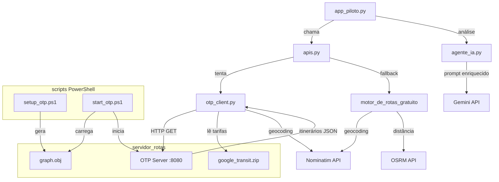

# Design Document — Roteirização Real SP

## Overview

Esta feature substitui o motor de rotas simulado (`motor_de_rotas_gratuito()`) por um motor real integrado ao OpenTripPlanner (OTP) local, alimentado pelo GTFS oficial da SPTrans e pelo mapa OSM de São Paulo. O sistema existente continua funcionando via fallback quando o OTP não está disponível.

Os componentes afetados são:

- **`otp_client.py`** (novo): cliente OTP + parser GTFS de tarifas
- **`apis.py`** (atualizado): importa `otp_client.py` e delega para ele, mantendo `motor_de_rotas_gratuito()` intacto
- **`agente_ia.py`** (atualizado): prompt enriquecido com dados reais de linhas, transferências e caminhada
- **`servidor_rotas/setup_otp.ps1`** e **`start_otp.ps1`** (corrigidos): resolução de caminhos independente do diretório de trabalho

---

## Architecture



### Fluxo principal

1. `app_piloto.py` chama `motor_de_rotas_otp(end_casa, end_trab)` em `apis.py`
2. `apis.py` delega para `otp_client.py`
3. `otp_client.py` geocodifica os endereços via Nominatim, consulta o OTP e parseia os itinerários
4. As tarifas são lidas do GTFS na inicialização do módulo
5. Se o OTP falhar, `apis.py` chama `motor_de_rotas_gratuito()` como fallback
6. O resultado (real ou fallback) é passado para `agente_ia.py` com metadados enriquecidos

---

## Components and Interfaces

### `otp_client.py` (novo)

Responsabilidades:
- Carregar tarifas do GTFS na inicialização
- Geocodificar endereços via Nominatim
- Consultar a API REST do OTP
- Parsear itinerários e extrair nomes reais de linhas
- Aplicar tarifas corretas por modal
- Preencher com fallback quando necessário

```python
# Função pública principal
def motor_de_rotas_otp(end_casa: str, end_trab: str) -> dict:
    """
    Retorna dict com mesma estrutura de motor_de_rotas_gratuito():
    {
        "rotas": [
            {
                "modal": str,       # ex: "🚌 Apenas Ônibus"
                "trajeto": str,     # ex: "Ônibus 8012-10 SPTrans → Metrô Linha 2-Verde"
                "valor_diario": float,
                "tempo": str,       # ex: "47 min"
                "bilhete": str
            },
            ...  # sempre 3 itens
        ],
        "distancia_km": float,
        "coords_reais": [(lat_c, lon_c), (lat_t, lon_t)],
        "info_tarifas": str         # ex: "GTFS SPTrans 2025"
    }
    """

# Funções internas
def _carregar_tarifas_gtfs(zip_path: str) -> dict: ...
def _consultar_otp(lat_o, lon_o, lat_d, lon_d) -> list[dict]: ...
def _parsear_itinerario(itinerary: dict, tarifas: dict) -> dict: ...
def _classificar_modal(legs: list[dict]) -> str: ...
def _extrair_trajeto(legs: list[dict]) -> str: ...
def _calcular_tarifa(legs: list[dict], tarifas: dict) -> tuple[float, str]: ...
def _verificar_otp_disponivel() -> bool: ...  # chamado assincronamente na importação
```

### `apis.py` (atualizado)

Adiciona a função `motor_de_rotas_otp()` que envolve `otp_client.py` com fallback:

```python
# Adicionado no topo de apis.py
try:
    from otp_client import motor_de_rotas_otp as _motor_otp
    _OTP_DISPONIVEL = True
except ImportError:
    _OTP_DISPONIVEL = False

def motor_de_rotas_otp(end_casa: str, end_trab: str) -> dict:
    """Wrapper com fallback automático para motor_de_rotas_gratuito()."""
    if _OTP_DISPONIVEL:
        return _motor_otp(end_casa, end_trab)
    return motor_de_rotas_gratuito(end_casa, end_trab)
```

`motor_de_rotas_gratuito()` permanece **sem nenhuma alteração**.

### `agente_ia.py` (atualizado)

A assinatura de `analisar_rota_com_ia()` é estendida para receber metadados adicionais:

```python
def analisar_rota_com_ia(
    rua_casa: str,
    rua_trab: str,
    distancia_km: float,
    rotas: list[dict],
    info_tarifas: str,
    # Novos parâmetros opcionais (retrocompatíveis):
    transferencias: list[int] | None = None,   # ex: [1, 0, 2]
    tempos_caminhada: list[int] | None = None, # ex: [8, 12, 5] minutos
    fonte_dados: str = "estimado"              # "otp_real" ou "estimado"
) -> str: ...
```

O prompt é enriquecido com:
- Nomes reais das linhas (campo `trajeto` de cada rota)
- Número de transferências por opção
- Tempo de caminhada por opção
- Indicação explícita de "dados reais OTP" vs "estimativa"

### Scripts PowerShell

**`setup_otp.ps1`** — correção de caminhos:

```powershell
# Resolve o diretório do script independentemente do CWD
$ScriptDir = Split-Path -Parent $MyInvocation.MyCommand.Path
$ProjectRoot = Split-Path -Parent $ScriptDir
$ServidorDir = Join-Path $ProjectRoot "servidor_rotas"
$SaoPauloDir = Join-Path $ServidorDir "saopaulo"
```

**`start_otp.ps1`** — mesma correção + verificação de `graph.obj`:

```powershell
$ScriptDir = Split-Path -Parent $MyInvocation.MyCommand.Path
$GraphPath = Join-Path $ScriptDir "saopaulo\graph.obj"

if (-not (Test-Path $GraphPath)) {
    Write-Error "graph.obj não encontrado. Execute setup_otp.ps1 primeiro."
    exit 1
}
```

---

## Data Models

### OTP API Request

```
GET http://localhost:8080/otp/routers/default/plan
  ?fromPlace={lat},{lon}
  &toPlace={lat},{lon}
  &time=08:00am
  &date=2025-01-01
  &mode=TRANSIT,WALK
  &numItineraries=5
  &locale=pt
```

### OTP Itinerary (resposta relevante)

```python
{
    "duration": int,          # segundos totais
    "legs": [
        {
            "mode": str,      # "WALK", "BUS", "SUBWAY", "RAIL", "TRAM"
            "duration": int,  # segundos deste trecho
            "route": str,     # nome curto da linha, ex: "8012-10"
            "agencyName": str,# ex: "SPTrans", "Metrô SP"
            "distance": float # metros
        }
    ]
}
```

### Estrutura interna de tarifas (carregada do GTFS)

```python
FareTable = {
    "bus_only":         {"price": 5.82, "label": "Crédito Eletrônico VT (Ônibus SPTrans)"},
    "metro_only":       {"price": 5.92, "label": "Crédito Eletrônico VT (Metrô/CPTM)"},
    "integration":      {"price": 11.32, "label": "Integração VT (Ônibus + Metrô/CPTM)"},
    "source":           str   # "GTFS SPTrans 2025" ou "Tabela fixa 2026"
}
```

### Estrutura de retorno de `motor_de_rotas_otp()` (compatível com `motor_de_rotas_gratuito()`)

```python
{
    "rotas": [
        {
            "modal":       str,   # "🚌 Apenas Ônibus" | "🚇 Apenas Metrô/CPTM" | "🔄 Integração"
            "trajeto":     str,   # "Ônibus 8012-10 SPTrans → Metrô Linha 2-Verde"
                                  # ou "Ônibus Municipal (SPTrans) (estimado)"
            "valor_diario": float,
            "tempo":       str,   # "47 min"
            "bilhete":     str
        },
        # ... sempre 3 itens
    ],
    "distancia_km":  float,
    "coords_reais":  [(float, float), (float, float)],
    "info_tarifas":  str    # "GTFS SPTrans 2025" ou "Tabela fixa 2026"
}
```

### Metadados adicionais para o agente de IA

```python
RouteMetadata = {
    "transferencias":    list[int],  # número de transferências por opção [1, 0, 2]
    "tempos_caminhada":  list[int],  # minutos de caminhada por opção [8, 12, 5]
    "fonte_dados":       str         # "otp_real" | "estimado"
}
```

---

## Correctness Properties

*A property is a characteristic or behavior that should hold true across all valid executions of a system — essentially, a formal statement about what the system should do. Properties serve as the bridge between human-readable specifications and machine-verifiable correctness guarantees.*

### Property 1: Compatibilidade de assinatura de retorno

*Para qualquer* par de endereços válidos em São Paulo, `motor_de_rotas_otp()` deve retornar um dicionário com exatamente as mesmas chaves de nível superior que `motor_de_rotas_gratuito()` (`rotas`, `distancia_km`, `coords_reais`, `info_tarifas`), e cada item em `rotas` deve conter as chaves `modal`, `trajeto`, `valor_diario`, `tempo` e `bilhete`.

**Validates: Requirements 2.1, 6.1**

---

### Property 2: Sempre 3 opções de rota com fallback marcado

*Para qualquer* resposta do OTP (incluindo respostas com 0, 1 ou 2 itinerários distintos por modal), `motor_de_rotas_otp()` deve retornar exatamente 3 opções de rota. Toda opção preenchida por fallback deve conter o sufixo `"(estimado)"` no campo `trajeto`.

**Validates: Requirements 2.3, 2.7, 5.3**

---

### Property 3: Nomes reais de linhas no campo `trajeto`

*Para qualquer* itinerário OTP que contenha N trechos de transporte público (N ≥ 1), o campo `trajeto` da rota correspondente deve conter os nomes reais de todas as N linhas, separados por `" → "`.

**Validates: Requirements 2.4, 2.5, 5.1, 5.2**

---

### Property 4: Tempo de viagem derivado do campo `duration` do OTP

*Para qualquer* itinerário OTP com campo `duration` em segundos, o campo `tempo` da rota correspondente deve ser igual a `ceil(duration / 60)` minutos, sem estimativas aleatórias.

**Validates: Requirements 2.6, 5.4**

---

### Property 5: Tarifa correta por modal

*Para qualquer* itinerário OTP, a tarifa aplicada e o campo `bilhete` devem corresponder ao modal predominante:
- Somente ônibus (BUS): `valor_diario == 5.82 * 2`, `bilhete` contém `"Ônibus SPTrans"`
- Somente metrô/CPTM (SUBWAY/RAIL): `valor_diario == 5.92 * 2`, `bilhete` contém `"Metrô/CPTM"`
- Integração (BUS + SUBWAY/RAIL): `valor_diario == 11.32 * 2`, `bilhete` contém `"Integração"`

**Validates: Requirements 3.2, 3.3, 3.4, 3.5**

---

### Property 6: `info_tarifas` sempre indica a fonte dos dados

*Para qualquer* chamada a `motor_de_rotas_otp()`, o campo `info_tarifas` deve ser uma string não-vazia que identifica a fonte dos dados de tarifa utilizada (`"GTFS SPTrans 2025"` ou `"Tabela fixa 2026"`).

**Validates: Requirements 3.7**

---

### Property 7: Coordenadas reais preservadas no retorno

*Para qualquer* par de endereços geocodificados via Nominatim com coordenadas `(lat_c, lon_c)` e `(lat_t, lon_t)`, o campo `coords_reais` do retorno deve conter exatamente esses valores na ordem `[(lat_c, lon_c), (lat_t, lon_t)]`.

**Validates: Requirements 2.9**

---

### Property 8: Prompt do agente contém dados reais de linhas, transferências e caminhada

*Para qualquer* conjunto de dados de rota com nomes reais de linhas, contagens de transferências e tempos de caminhada, o prompt construído por `analisar_rota_com_ia()` deve conter: (a) pelo menos um nome de linha real, (b) o número de transferências de cada opção, (c) o tempo de caminhada de cada opção, e (d) a indicação explícita de `"dados reais OTP"` ou `"estimativa"` para cada opção.

**Validates: Requirements 4.1, 4.2, 4.3, 4.4**

---

## Error Handling

| Cenário | Comportamento |
|---|---|
| OTP inacessível (`ConnectionError`, timeout) | `otp_client.py` captura a exceção, loga um aviso, retorna `None`; `apis.py` chama `motor_de_rotas_gratuito()` |
| OTP retorna resposta inválida / sem itinerários | Trata como 0 itinerários; fallback preenche as 3 opções com `"(estimado)"` |
| GTFS zip ausente ou corrompido | `_carregar_tarifas_gtfs()` retorna a tabela hardcoded de `apis.py`; `info_tarifas` indica `"Tabela fixa 2026"` |
| Nominatim falha na geocodificação | Usa coordenadas padrão de São Paulo (`-23.5505, -46.6333`), igual ao comportamento atual |
| Java não encontrado (scripts PS) | `setup_otp.ps1` exibe mensagem de erro com versão mínima requerida e encerra com `exit 1` |
| `graph.obj` ausente ao iniciar OTP | `start_otp.ps1` exibe mensagem orientando a executar `setup_otp.ps1` e encerra com `exit 1` |
| Chave Gemini ausente | `agente_ia.py` retorna a mensagem de aviso existente, sem alterações |

---

## Testing Strategy

### Abordagem dual

- **Testes unitários**: exemplos concretos, condições de erro, edge cases
- **Testes de propriedade**: propriedades universais sobre o comportamento do `otp_client.py` e `agente_ia.py`

A biblioteca de property-based testing escolhida é **[Hypothesis](https://hypothesis.readthedocs.io/)** (Python), com mínimo de 100 iterações por propriedade.

### Testes de propriedade

Cada propriedade do design deve ser implementada como um único teste Hypothesis. O HTTP do OTP e do Nominatim deve ser mockado para isolar a lógica do módulo.

Tag format: `# Feature: roteirizacao-real-sp, Property {N}: {texto}`

| Propriedade | Estratégia Hypothesis |
|---|---|
| P1 — Compatibilidade de assinatura | `@given(st.text(), st.text())` com mock OTP/Nominatim |
| P2 — Sempre 3 opções com fallback marcado | `@given(st.lists(itinerary_strategy(), max_size=5))` |
| P3 — Nomes reais de linhas no trajeto | `@given(itinerary_with_transit_legs())` |
| P4 — Tempo derivado de `duration` | `@given(st.integers(min_value=60, max_value=7200))` |
| P5 — Tarifa correta por modal | `@given(itinerary_by_mode_strategy())` |
| P6 — `info_tarifas` não-vazio | `@given(st.text(), st.text())` |
| P7 — Coordenadas preservadas | `@given(lat_lon_strategy(), lat_lon_strategy())` |
| P8 — Prompt contém dados reais | `@given(route_metadata_strategy())` |

### Testes unitários (exemplos e edge cases)

- OTP inacessível → fallback retorna estrutura válida
- GTFS zip ausente → tarifas hardcoded são usadas
- `graph.obj` ausente → `start_otp.ps1` encerra com código não-zero
- Java ausente → `setup_otp.ps1` exibe mensagem de erro
- Chave Gemini ausente → mensagem de aviso retornada
- Importação de `otp_client.py` não bloqueia (tempo de import < 2s com mock)

### Testes de integração (não PBT)

- OTP real retorna itinerários válidos para par de endereços em SP (1-2 exemplos)
- GTFS zip real é lido e tarifas são carregadas corretamente
- `motor_de_rotas_gratuito()` continua retornando dados válidos após a adição de `otp_client.py`
