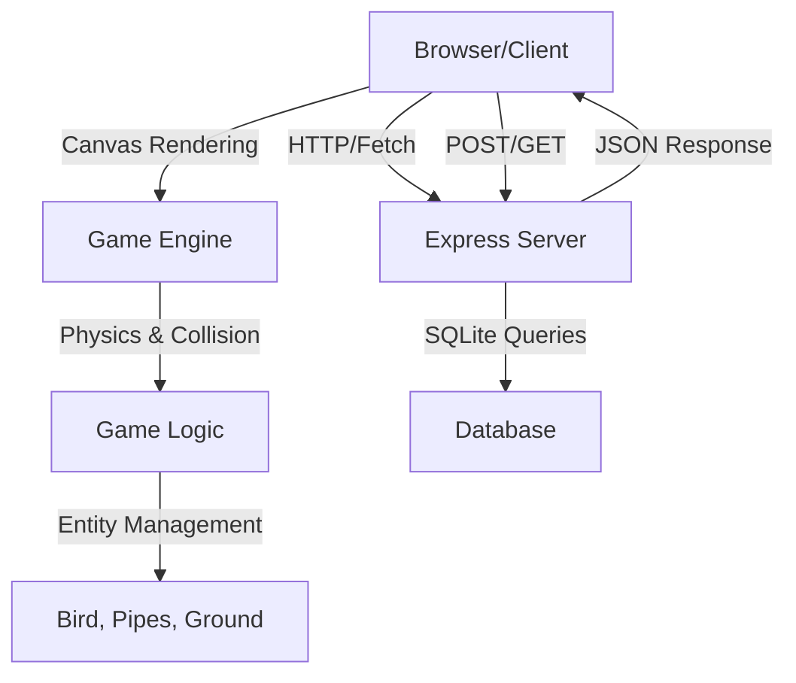
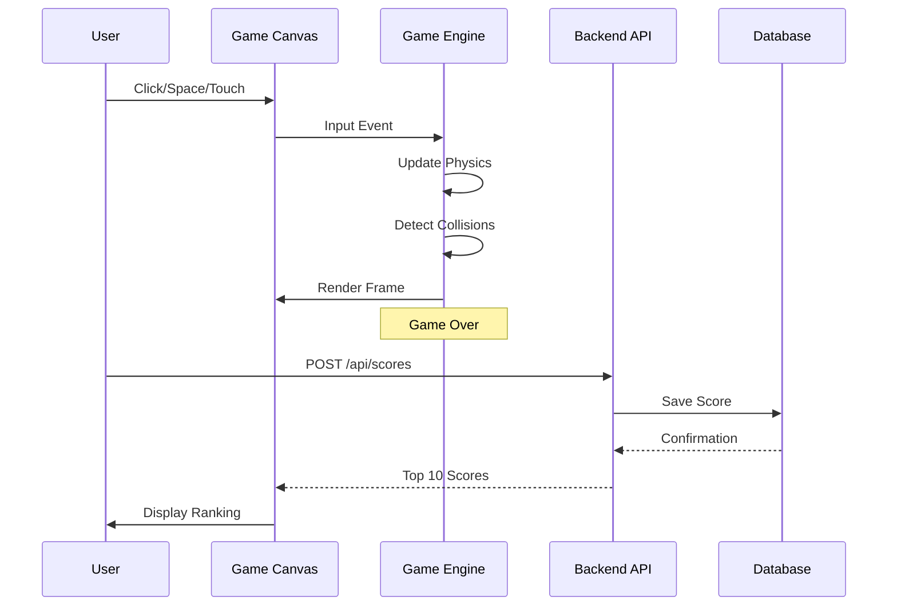

# Design Document: Flappy Bird Game

## Overview

Flappy Bird é um jogo 2D clássico onde o jogador controla um pássaro que deve evitar obstáculos (canos) enquanto cai pela gravidade. O projeto implementa uma versão completa com front-end em HTML5 Canvas + JavaScript ES6+ (POO) e back-end em Node.js + Express para gerenciar pontuações. A arquitetura separa claramente a lógica de jogo (client-side) da persistência de dados (server-side), com comunicação via API REST.

## Architecture



### Fluxo de Dados Principal



## Components and Interfaces

### Front-end Components

#### 1. Game Engine (game.js)

**Responsabilidade**: Orquestrar o loop de jogo, gerenciar estados e coordenar atualizações

```javascript
class GameEngine {
  constructor(canvasElement, width = 400, height = 600)
  
  // Métodos principais
  start(): void
  update(deltaTime: number): void
  render(): void
  handleInput(inputType: 'jump' | 'pause'): void
  gameOver(): void
  reset(): void
  
  // Getters
  getScore(): number
  getGameState(): 'menu' | 'playing' | 'gameOver' | 'paused'
  getEntities(): Entity[]
}
```

**Responsabilidades**:
- Inicializar canvas e contexto 2D
- Gerenciar o game loop com requestAnimationFrame
- Coordenar atualização de entidades
- Detectar colisões
- Renderizar frame
- Gerenciar transições de estado

#### 2. Entity System (entities.js)

**Base Class: Entity**

```javascript
class Entity {
  constructor(x: number, y: number, width: number, height: number)
  
  // Métodos abstratos
  update(deltaTime: number): void
  render(ctx: CanvasRenderingContext2D): void
  getBounds(): AABB
}
```

**Bird Class**

```javascript
class Bird extends Entity {
  constructor(x: number, y: number)
  
  // Propriedades
  velocity: number
  gravity: number = 0.6
  jumpForce: number = -12
  
  // Métodos
  jump(): void
  update(deltaTime: number): void
  render(ctx: CanvasRenderingContext2D): void
  isAlive(): boolean
}
```

**Pipe Class**

```javascript
class Pipe extends Entity {
  constructor(x: number, gapY: number, gapHeight: number)
  
  // Propriedades
  speed: number = -4
  gapY: number
  gapHeight: number
  scored: boolean = false
  
  // Métodos
  update(deltaTime: number): void
  render(ctx: CanvasRenderingContext2D): void
  isOffScreen(): boolean
  hasBeenScored(): boolean
}
```

**Ground Class**

```javascript
class Ground extends Entity {
  constructor(y: number, width: number)
  
  // Propriedades
  speed: number = -4
  
  // Métodos
  update(deltaTime: number): void
  render(ctx: CanvasRenderingContext2D): void
}
```

#### 3. Collision Detection (game.js)

```javascript
interface AABB {
  x: number
  y: number
  width: number
  height: number
}

class CollisionDetector {
  static checkAABB(rect1: AABB, rect2: AABB): boolean
  static checkBirdPipeCollision(bird: Bird, pipe: Pipe): boolean
  static checkBirdGroundCollision(bird: Bird, ground: Ground): boolean
  static checkPipeScore(bird: Bird, pipe: Pipe): boolean
}
```

#### 4. API Client (api.js)

```javascript
class ScoreAPI {
  static async getTopScores(limit: number = 10): Promise<Score[]>
  static async saveScore(playerName: string, score: number): Promise<Score>
  static async getAllScores(): Promise<Score[]>
}

interface Score {
  id: number
  playerName: string
  score: number
  timestamp: string
}
```

### Back-end Components

#### 1. Express Server (server.js)

```javascript
class GameServer {
  constructor(port: number = 3000)
  
  // Métodos
  start(): void
  setupRoutes(): void
  setupDatabase(): void
}
```

**Routes**:
- `GET /api/scores` - Retorna top 10 pontuações
- `POST /api/scores` - Salva nova pontuação
- `GET /` - Serve frontend estático

#### 2. Database Layer

```javascript
interface ScoreRecord {
  id: number
  playerName: string
  score: number
  timestamp: string
}

class ScoreRepository {
  static async create(playerName: string, score: number): Promise<ScoreRecord>
  static async getTopScores(limit: number = 10): Promise<ScoreRecord[]>
  static async getAll(): Promise<ScoreRecord[]>
}
```

## Data Models

### Game State

```javascript
interface GameState {
  score: number
  status: 'menu' | 'playing' | 'gameOver' | 'paused'
  highScore: number
  playerName: string | null
  timestamp: number
}
```

### Bird Model

```javascript
interface BirdState {
  x: number
  y: number
  width: number = 34
  height: number = 24
  velocity: number
  gravity: number = 0.6
  jumpForce: number = -12
  isAlive: boolean
}
```

### Pipe Model

```javascript
interface PipeState {
  x: number
  gapY: number
  gapHeight: number = 120
  width: number = 52
  speed: number = -4
  scored: boolean
}
```

### Score Model (Database)

```javascript
interface ScoreRecord {
  id: number
  playerName: string
  score: number
  timestamp: string
}
```

## Algorithmic Pseudocode

### Main Game Loop Algorithm

```pascal
ALGORITHM gameLoop(deltaTime)
INPUT: deltaTime (milliseconds since last frame)
OUTPUT: None (updates game state and renders)

PRECONDITION:
  - Canvas context is initialized
  - All entities are created
  - Game state is valid

POSTCONDITION:
  - All entities have been updated
  - Collisions have been detected
  - Frame has been rendered
  - Game state reflects current conditions

BEGIN
  // Step 1: Handle input
  IF inputQueue is not empty THEN
    FOR each input IN inputQueue DO
      IF input = 'jump' THEN
        bird.jump()
      END IF
    END FOR
    CLEAR inputQueue
  END IF
  
  // Step 2: Update all entities
  bird.update(deltaTime)
  
  FOR each pipe IN activePipes DO
    pipe.update(deltaTime)
  END FOR
  
  ground.update(deltaTime)
  
  // Step 3: Spawn new pipes if needed
  IF shouldSpawnPipe() THEN
    newPipe ← createRandomPipe()
    activePipes.add(newPipe)
  END IF
  
  // Step 4: Remove off-screen pipes
  FOR each pipe IN activePipes DO
    IF pipe.isOffScreen() THEN
      activePipes.remove(pipe)
    END IF
  END FOR
  
  // Step 5: Collision detection
  FOR each pipe IN activePipes DO
    IF checkBirdPipeCollision(bird, pipe) THEN
      bird.setAlive(false)
      gameState ← 'gameOver'
    END IF
    
    IF checkPipeScore(bird, pipe) AND NOT pipe.hasBeenScored() THEN
      score ← score + 1
      pipe.markScored()
    END IF
  END FOR
  
  IF checkBirdGroundCollision(bird, ground) THEN
    bird.setAlive(false)
    gameState ← 'gameOver'
  END IF
  
  // Step 6: Render frame
  clearCanvas()
  renderBackground()
  
  FOR each pipe IN activePipes DO
    pipe.render(ctx)
  END FOR
  
  ground.render(ctx)
  bird.render(ctx)
  renderHUD(score)
  
  // Step 7: Schedule next frame
  IF gameState = 'playing' THEN
    requestAnimationFrame(gameLoop)
  END IF
END
```

**Loop Invariants**:
- All active pipes are within or recently off-screen
- Bird position is always within canvas bounds (or just below for game over)
- Score only increases when bird crosses pipe center
- Each pipe is scored at most once

### Physics Update Algorithm

```pascal
ALGORITHM updateBirdPhysics(bird, deltaTime)
INPUT: bird (Bird entity), deltaTime (milliseconds)
OUTPUT: None (updates bird velocity and position)

PRECONDITION:
  - bird is not null
  - deltaTime > 0
  - bird.velocity is a valid number

POSTCONDITION:
  - bird.velocity has been updated with gravity
  - bird.y has been updated with new velocity
  - bird.velocity reflects current falling/jumping state

BEGIN
  // Step 1: Apply gravity
  bird.velocity ← bird.velocity + bird.gravity
  
  // Step 2: Apply terminal velocity cap (optional optimization)
  IF bird.velocity > MAX_VELOCITY THEN
    bird.velocity ← MAX_VELOCITY
  END IF
  
  // Step 3: Update position
  bird.y ← bird.y + bird.velocity
  
  // Step 4: Clamp to canvas bounds (visual only, collision handled separately)
  IF bird.y < 0 THEN
    bird.y ← 0
  END IF
  
  IF bird.y + bird.height > CANVAS_HEIGHT THEN
    bird.y ← CANVAS_HEIGHT - bird.height
  END IF
END
```

**Loop Invariants**: N/A (no loops in this algorithm)

### Collision Detection - AABB Algorithm

```pascal
ALGORITHM checkAABBCollision(rect1, rect2)
INPUT: rect1 (AABB), rect2 (AABB)
OUTPUT: isColliding (boolean)

PRECONDITION:
  - rect1 and rect2 are valid AABB structures
  - All coordinates and dimensions are non-negative

POSTCONDITION:
  - Returns true if rectangles overlap, false otherwise
  - No side effects on input rectangles

BEGIN
  // Check if rectangles are separated on any axis
  IF rect1.x + rect1.width < rect2.x THEN
    RETURN false  // rect1 is left of rect2
  END IF
  
  IF rect1.x > rect2.x + rect2.width THEN
    RETURN false  // rect1 is right of rect2
  END IF
  
  IF rect1.y + rect1.height < rect2.y THEN
    RETURN false  // rect1 is above rect2
  END IF
  
  IF rect1.y > rect2.y + rect2.height THEN
    RETURN false  // rect1 is below rect2
  END IF
  
  // If not separated on any axis, they must be colliding
  RETURN true
END
```

**Loop Invariants**: N/A (no loops)

### Pipe Scoring Algorithm

```pascal
ALGORITHM checkPipeScore(bird, pipe)
INPUT: bird (Bird entity), pipe (Pipe entity)
OUTPUT: shouldScore (boolean)

PRECONDITION:
  - bird and pipe are valid entities
  - pipe.scored is a boolean flag
  - bird.x and pipe.x are valid coordinates

POSTCONDITION:
  - Returns true if bird has crossed pipe center and hasn't been scored yet
  - Does not modify bird or pipe state

BEGIN
  // Get bird center X coordinate
  birdCenterX ← bird.x + (bird.width / 2)
  
  // Get pipe center X coordinate
  pipeCenterX ← pipe.x + (pipe.width / 2)
  
  // Check if bird has just crossed pipe center
  IF birdCenterX > pipeCenterX AND NOT pipe.scored THEN
    RETURN true
  ELSE
    RETURN false
  END IF
END
```

**Loop Invariants**: N/A (no loops)

### Random Pipe Gap Generation Algorithm

```pascal
ALGORITHM generateRandomPipeGap()
INPUT: None
OUTPUT: gapY (number - Y coordinate of gap top)

PRECONDITION:
  - MIN_GAP_Y and MAX_GAP_Y constants are defined
  - MIN_GAP_Y < MAX_GAP_Y
  - GAP_HEIGHT is defined and reasonable

POSTCONDITION:
  - Returns valid gapY that ensures pipe is within canvas
  - gapY + GAP_HEIGHT < CANVAS_HEIGHT
  - gapY > 0

BEGIN
  // Generate random gap position ensuring it fits in canvas
  randomValue ← random(0, 1)
  
  gapRange ← MAX_GAP_Y - MIN_GAP_Y
  gapY ← MIN_GAP_Y + (randomValue * gapRange)
  
  // Ensure gap doesn't exceed canvas bounds
  IF gapY + GAP_HEIGHT > CANVAS_HEIGHT THEN
    gapY ← CANVAS_HEIGHT - GAP_HEIGHT
  END IF
  
  IF gapY < 0 THEN
    gapY ← 0
  END IF
  
  RETURN gapY
END
```

**Loop Invariants**: N/A (no loops)

## Key Functions with Formal Specifications

### Bird.jump()

```javascript
function jump(): void
```

**Preconditions**:
- Bird object is initialized
- `this.velocity` is a valid number

**Postconditions**:
- `this.velocity` is set to `this.jumpForce` (negative value)
- Bird will move upward in next physics update
- No other bird properties are modified

**Side Effects**: Modifies `this.velocity`

### Bird.update(deltaTime)

```javascript
function update(deltaTime: number): void
```

**Preconditions**:
- `deltaTime > 0`
- Bird position is within or near canvas bounds
- `this.gravity` and `this.velocity` are valid numbers

**Postconditions**:
- `this.velocity` has been updated with gravity applied
- `this.y` has been updated with new velocity
- Bird position is clamped to canvas bounds
- No collision detection performed (handled by engine)

**Side Effects**: Modifies `this.velocity` and `this.y`

### CollisionDetector.checkAABB(rect1, rect2)

```javascript
static checkAABB(rect1: AABB, rect2: AABB): boolean
```

**Preconditions**:
- Both rectangles have valid `x`, `y`, `width`, `height` properties
- All values are non-negative numbers

**Postconditions**:
- Returns `true` if rectangles overlap on both X and Y axes
- Returns `false` if rectangles are separated on any axis
- No modifications to input rectangles

**Side Effects**: None (pure function)

### GameEngine.update(deltaTime)

```javascript
function update(deltaTime: number): void
```

**Preconditions**:
- `deltaTime > 0`
- All entities are initialized
- Game state is valid

**Postconditions**:
- All entities have been updated
- Collisions have been detected and handled
- Score has been updated if pipes were crossed
- Game state may transition to 'gameOver'
- Off-screen pipes have been removed

**Side Effects**: Modifies entity positions, game state, and score

### ScoreAPI.saveScore(playerName, score)

```javascript
static async saveScore(playerName: string, score: number): Promise<Score>
```

**Preconditions**:
- `playerName` is a non-empty string
- `score` is a non-negative integer
- Server is reachable

**Postconditions**:
- Score record is persisted to database
- Returns Score object with `id`, `playerName`, `score`, `timestamp`
- Timestamp is server-generated

**Side Effects**: Creates database record, network request

### ScoreAPI.getTopScores(limit)

```javascript
static async getTopScores(limit: number = 10): Promise<Score[]>
```

**Preconditions**:
- `limit` is a positive integer
- Server is reachable

**Postconditions**:
- Returns array of Score objects sorted by score descending
- Array length ≤ `limit`
- Each Score has valid `id`, `playerName`, `score`, `timestamp`

**Side Effects**: Network request

## Example Usage

### Game Initialization

```javascript
// Initialize game engine
const canvas = document.getElementById('gameCanvas');
const engine = new GameEngine(canvas, 400, 600);

// Set up input listeners
document.addEventListener('keydown', (e) => {
  if (e.code === 'Space') {
    engine.handleInput('jump');
  }
});

canvas.addEventListener('click', () => {
  engine.handleInput('jump');
});

// Start game
engine.start();
```

### Game Over and Score Submission

```javascript
// When game ends
if (engine.getGameState() === 'gameOver') {
  const playerName = prompt('Enter your name:');
  const score = engine.getScore();
  
  // Save score to backend
  ScoreAPI.saveScore(playerName, score).then((savedScore) => {
    console.log('Score saved:', savedScore);
    
    // Get updated ranking
    return ScoreAPI.getTopScores(10);
  }).then((topScores) => {
    displayRanking(topScores);
  });
}
```

### Rendering Loop

```javascript
// Inside GameEngine.render()
const ctx = this.canvas.getContext('2d');

// Clear canvas
ctx.fillStyle = '#70C5CE'; // Sky blue
ctx.fillRect(0, 0, this.width, this.height);

// Render entities
this.bird.render(ctx);
this.activePipes.forEach(pipe => pipe.render(ctx));
this.ground.render(ctx);

// Render HUD
ctx.fillStyle = '#000000';
ctx.font = 'bold 24px Arial';
ctx.fillText(`Score: ${this.score}`, 20, 40);
```

## Correctness Properties

### Property 1: Score Monotonicity
```
∀ t1, t2 ∈ Time: t1 < t2 ⟹ score(t1) ≤ score(t2)
```
The score never decreases over time.

### Property 2: Bird Gravity Consistency
```
∀ frame: velocity(frame+1) = velocity(frame) + gravity
```
Gravity is consistently applied each frame.

### Property 3: Pipe Scoring Uniqueness
```
∀ pipe: pipe.scored = true ⟹ bird has crossed pipe center exactly once
```
Each pipe contributes to score at most once.

### Property 4: Collision Detection Symmetry
```
∀ rect1, rect2: checkAABB(rect1, rect2) = checkAABB(rect2, rect1)
```
Collision detection is symmetric.

### Property 5: Game Over Finality
```
gameState = 'gameOver' ⟹ ¬∃ future_frame: gameState ≠ 'gameOver'
```
Once game ends, it stays ended until reset.

## Error Handling

### Error Scenario 1: Network Failure on Score Save

**Condition**: POST /api/scores fails due to network error
**Response**: Display error message "Failed to save score. Please try again."
**Recovery**: Allow user to retry or continue to menu

### Error Scenario 2: Invalid Player Name

**Condition**: Player name is empty or contains invalid characters
**Response**: Display validation error "Please enter a valid name (1-20 characters)"
**Recovery**: Prompt user to enter valid name again

### Error Scenario 3: Canvas Not Found

**Condition**: Canvas element doesn't exist in DOM
**Response**: Throw error "Canvas element not found"
**Recovery**: Check HTML structure, ensure canvas element exists

### Error Scenario 4: Database Connection Error

**Condition**: SQLite database cannot be accessed
**Response**: Return 500 error with message "Database error"
**Recovery**: Server logs error, client shows "Server error. Please try again later"

## Testing Strategy

### Unit Testing Approach

**Test Framework**: Jest or Vitest

**Key Test Cases**:
1. **Physics Tests**:
   - Bird velocity increases with gravity each frame
   - Jump force correctly sets velocity to negative value
   - Terminal velocity is capped

2. **Collision Tests**:
   - AABB collision detects overlapping rectangles
   - AABB collision rejects separated rectangles
   - Bird-pipe collision detected correctly
   - Bird-ground collision detected correctly

3. **Scoring Tests**:
   - Score increments when bird crosses pipe
   - Score doesn't increment for same pipe twice
   - Score is 0 at game start

4. **Entity Tests**:
   - Bird position updates correctly
   - Pipes move at correct speed
   - Off-screen pipes are removed

### Property-Based Testing Approach

**Property Test Library**: fast-check (JavaScript)

**Key Properties**:
1. **Score Monotonicity**: Score never decreases
2. **Physics Consistency**: Velocity always increases by gravity
3. **Collision Symmetry**: Collision detection is symmetric
4. **Pipe Uniqueness**: Each pipe scored at most once

### Integration Testing Approach

1. **End-to-End Game Flow**:
   - Start game → Jump → Avoid pipes → Game over → Save score → View ranking

2. **API Integration**:
   - POST /api/scores saves score correctly
   - GET /api/scores returns top 10 in correct order
   - Concurrent score submissions handled correctly

3. **UI Integration**:
   - Canvas renders all entities
   - Input events trigger bird jump
   - Game over screen displays correctly
   - Ranking displays after score save

## Performance Considerations

- **Frame Rate**: Target 60 FPS using requestAnimationFrame
- **Entity Pooling**: Reuse pipe objects instead of creating/destroying
- **Collision Optimization**: Only check collisions for active pipes
- **Canvas Rendering**: Use double-buffering (implicit in canvas API)
- **Memory**: Limit active pipes to ~5-10 at any time
- **Network**: Debounce score submissions, cache top scores

## Security Considerations

- **Input Validation**: Validate player name length and characters
- **SQL Injection**: Use parameterized queries for database operations
- **XSS Prevention**: Sanitize player names before displaying
- **CORS**: Configure appropriate CORS headers on backend
- **Rate Limiting**: Implement rate limiting on /api/scores endpoint
- **Data Validation**: Validate score values (non-negative, reasonable max)

## Dependencies

**Front-end**:
- HTML5 Canvas API (native)
- Fetch API (native)
- ES6+ JavaScript (native)

**Back-end**:
- Node.js (runtime)
- Express.js (web framework)
- SQLite3 (database)
- CORS middleware (optional)

**Development**:
- Jest or Vitest (testing)
- fast-check (property-based testing)
- ESLint (linting)
- Prettier (formatting)
